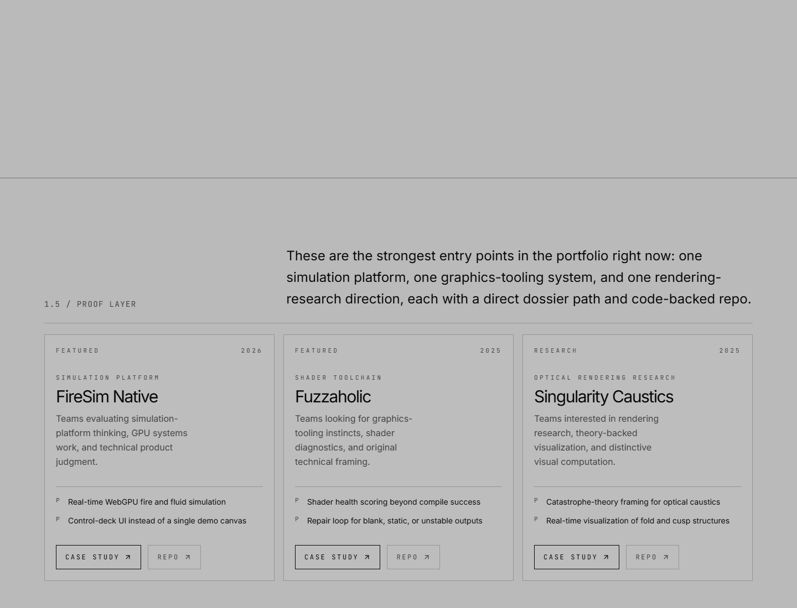
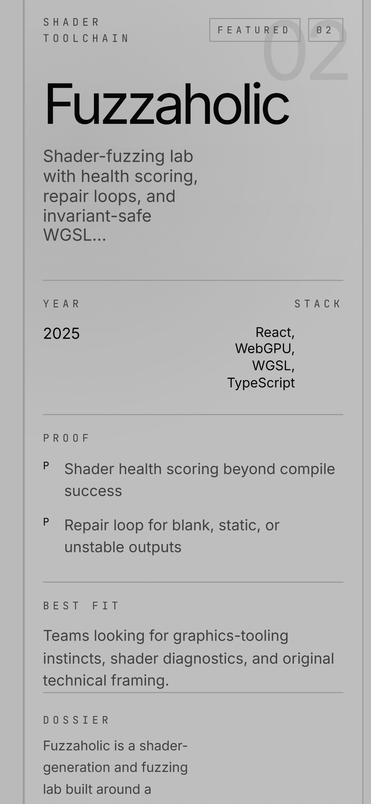
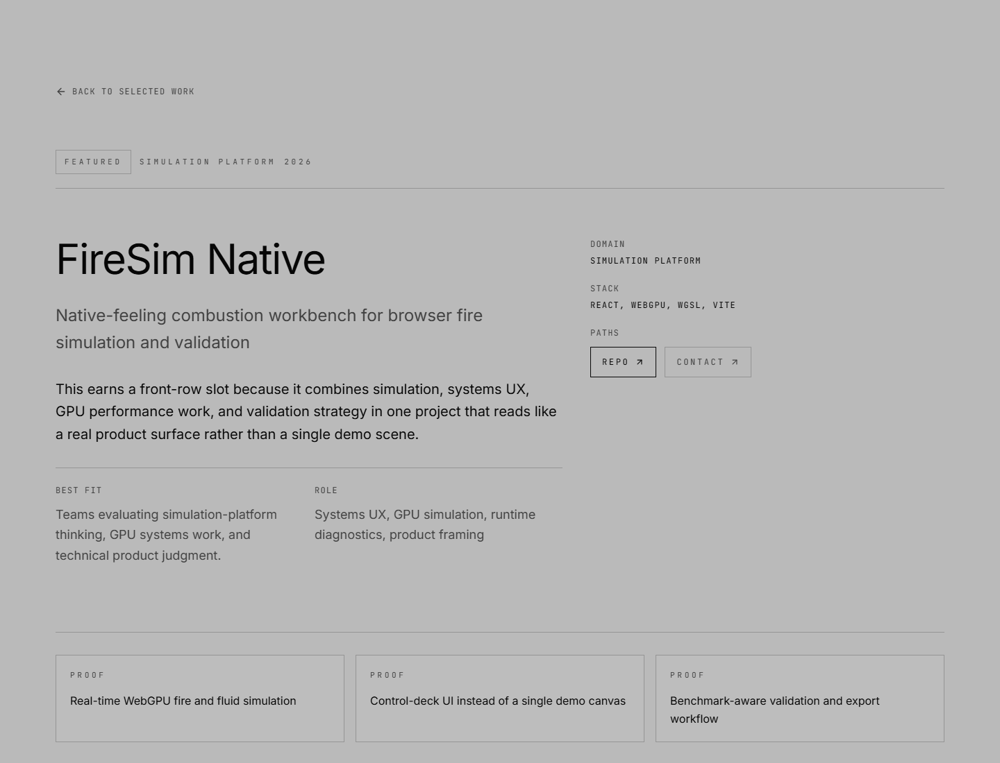

# portfolio-v4

Portfolio front door for Alex Figueroa's strongest current work in simulation, systems UX, graphics tooling, and rendering research.

This repo is no longer a generic AI Studio scaffold. It is the portfolio surface that curates a smaller set of stronger projects, gives each one a dossier-style detail page, and frames the work around real technical signals instead of filler.

## What This Surfaces

- `FireSim Native`: CUDA fire simulation, native tooling, validation workflow, and systems UX framing.
- `Filelight Explorer`: native Windows file explorer with preview depth and evidence-first file inspection.
- `Fuzzaholic`: shader-generation and fuzzing workbench with health scoring, repair loops, and WGSL guardrails.
- `Singularity Caustics`: rendering research surface for optical caustics and catastrophe-theory framing.

## Proof Snapshot

Desktop proof layer:

Mobile featured-work surface:

Detail-page proof for FireSim Native:

More context lives in [docs/proof/portfolio-refresh.md](docs/proof/portfolio-refresh.md).

## Run Locally

Prerequisites: Node.js 18+.

1. Install dependencies with `npm install`.
2. Start the dev server with `npm run dev`.
3. Build the production bundle with `npm run build`.
4. Type-check with `npm run lint`.

## Repo Notes

- Portfolio content and case-study framing live primarily in `src/data.ts` and `src/content/home.ts`.
- The visual proof above comes from the local Playwright capture pass under `output/playwright` and is now tracked in `docs/proof/media`.
- Remaining proof gap: there is still no short demo capture or hosted artifact index that walks the full navigation flow end to end.
